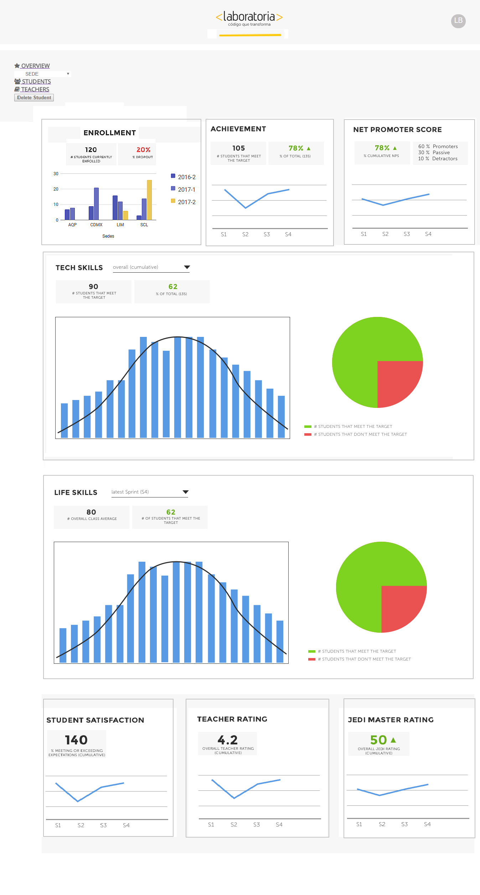

# Data Dashboard

* **Track:** _Common Core_
* **Curso:** _Creando tu primer sitio web interactivo_
* **Unidad:** _Producto final_

***
Producto:  Dashboard
Un dashboard es una representación gráfica de las principales métricas o KPIs (indicador clave o medidor de desempeño) requeridos por el cliente,   estas, nos muestran datos duros  sobre tòpicos importantes para la toma de acciones pertinentes.
El objetivo de nuestro producto entonces es conocer presentar los datos para un rápido análisis y con base a esto, fijar líneas de acción a seguir.
Proporciona una herramienta de trabajo que permite al TM (Training Manager)  visualizar y hacer estimaciones razonables sobre datos reales del desempeño de las estudiantes de Laboratoria  para la toma de decisiones y apoyarlo en su aprendizaje.

Usuarios meta:
Training Managers . Esta a cargo de de la coordinación del Bootcamp, identificará las necesidades de capacitación y desarrollo e impulsará iniciativas adecuadas.

Acerca de Dashboard Analyzer
Esta es la visualización de datos en un tablero centralizado enfocados en las necesidades reales del usuario, con un diseño intuitivo, sencillo de usar  y con potentes funciones para permitir a las partes interesadas descubrirla información que necesitan en el momento preciso  y comunicarlos a su equipo, una  herramienta que pueda ser actualizada, facilmente.

⦁ Ventajas competitivas
Adaptabilidad del cliente, la simplicidad de acceso, vista de indicadores de manera ordenada y armónica en cuanto a espacios.
Es un producto único y 100% customisable.
El usuario no requiere grandes  conocimientos técnicos,  es intuitivo y escalable.

⦁  Implementación:
Se progreso en lo que pensamos puede ser la primera etapa de esta herramienta.
Se piensa que sea responsive para que se tenga acceso a la informaciòn en cualquier tipo de dispositivo y lugar.

⦁	Mantenimiento
Esta planeada la construcción de la vista principal de login.

Funcionalidad, se tiene contemplado, además de los eventos "click" tener eventos hover para resaltar tópicos más importantes al pasar por ellos, lo pensamos en relación con los colores asociados a un semáforo, donde el verde representa números favorables, el amarillo aquellos indicadores en los que hay que prestar atención o se acercan a la mínima cifra requerida y el rojo para aquellas cifras que estan por debajo de lo esperado o que no son favorables.

Ejemplo de uso: Si la puntuación de los teachers  lo esperado, se les puede incentivar  o dar un reconocimiento, ya que con un vistazo, podemos identificar de forma rápida los promedios superados.
En un futuro la herramienta podría ahondar en el análisis de información de fuentes externas (como las encuestas de satisfacción al final de cada srpint) sin multiples y engorrosos archivos de excel.
Valor agregado, que los gráfico se podrán exportar en diferentes formatos e incluso imprimirlos -si se requiere- siempre con datos reales y actualizados.

UX responde a un portal de diseño limpio y en compliance con la imagen corporativa.
UI es importante del menú global que contiene eventos on click, hover, elementos del sitio detonaran el despliegue o interacciòn de la informaciòn.

